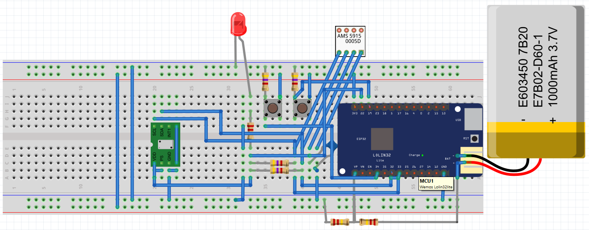

# IAS-Sensor for Paraglider
IAS Sensor for Paraglider

# Source Code

[Code](./src/IAS-Sensor/)

# Source for 3D Printing
[STL File](./CAD/IAS-Sensor.stl)

[Tinkercad Repository](https://www.tinkercad.com/things/6UoSo7RaL3y-ias-sensor-v2)

Amazingly, SeeYou works just as well with an external sensor as the Bräuniger Compeo+. I read barometric data about 12 times per second to smooth it, but I only send it twice per second.
Here’s a video: Unfortunately, the Omni screen is too bright, but the phone and the Compeo+ can be compared well. I also find the acoustics quite good.

https://youtu.be/q-oeLMd8ZC4

Let me know if you need further adjustments! 

