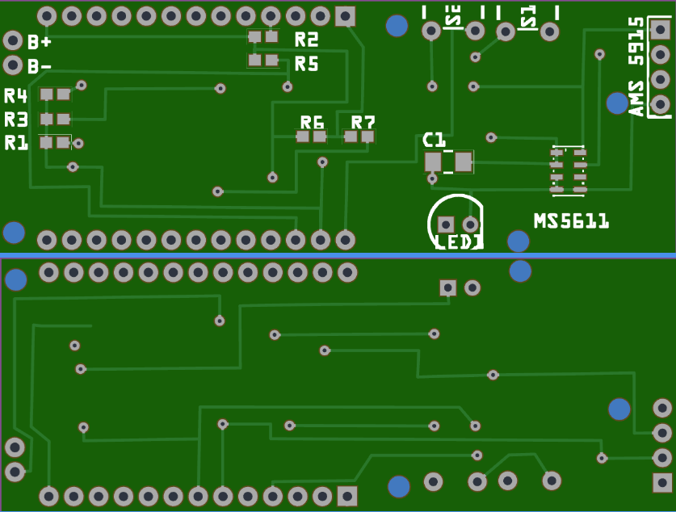

# IAS-Sensor for Paraglider
IAS Sensor for Paraglider

# Mounting on the paraglider

# Source Code

[Code](./src/IAS-Sensor/)

# Source for 3D Printing & PCB
[STL File](./CAD/IAS-SensorV3.stl)

[Tinkercad Repository](https://www.tinkercad.com/things/6USzTzKrwmQ-IAS-SensorV3)

[PCB Fritzing File](./board/IAS-Sensor3.fzz)

[PCB Fabricate](https://aisler.net/p/TXLLIEFP)

Amazingly, SeeYou works just as well with an external sensor as the Bräuniger Compeo+. I read barometric data about 12 times per second to smooth it, but I only send it twice per second.
Here’s a video: Unfortunately, the Omni screen is too bright, but the phone and the Compeo+ can be compared well. I also find the acoustics quite good.

https://youtu.be/q-oeLMd8ZC4

Let me know if you need further adjustments! 

# Components

| Name                               | Amount   |   Price(~)   |       Source                            |
| ---------------------------------- | ---------| ------------ | --------------------------------------- |
| SMD Tate                           |       2  |     0,42 €   |  www.reichelt.de                        |
| LED                                |       1  |     0,09 €   |  www.reichelt.de                        |
| R 220 Ω                            |       1  |     0,02 €   |  www.reichelt.de                        |
| R 4,7 kΩ                           |       4  |     0,02 €   |  www.reichelt.de                        |
| R 220 kΩ                           |       2  |     0,02 €   |  www.reichelt.de                        |
| C 100 nF                           |       1  |     0,02 €   |  www.reichelt.de                        |
| Shipping (reichelt)                |       1  |     5,95 €   |  www.reichelt.de                        |
| MS5611                             |       1  |     8,37 €   |  E-Bay                                  |
| AMS 5915 0005D                     |       1  |    27,50 €   |  www.analog-micro.com                   |
| Lolin32 Lite                       |       1  |     5,91 €   |  E-Bay                                  |
| Lipo 1000mA                        |       1  |     6,58 €   |  E-Bay                                  |
| Pitot with 3 Outputs               |       1  |    30,00 €   |  or self-build (show build instructons) |
| Case and lid for MS5611 (3D Print) |       1  |    30,00 €   |  or self-build (show build instructons) |
| Circuit board (PCB)                |       1  |     8,00 €   |  https://aisler.net                     |

## Price approx:	122,00 €	
